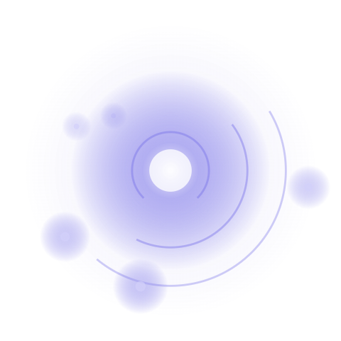
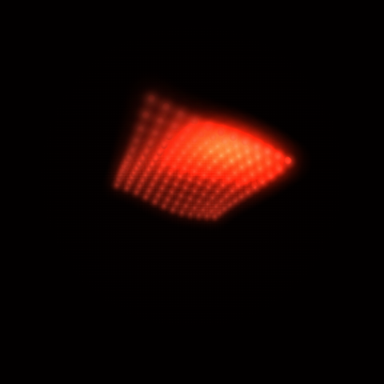
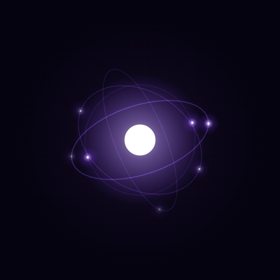
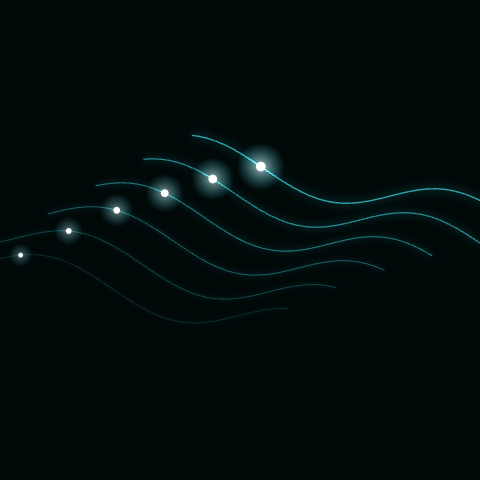

# Velaris agent avatar — state model prototypes

Six renderer explorations for a single agent avatar state contract: the avatar is driven by a small set of continuous parameters (energy, speed, spread, hue, jitter, etc.) that tween toward a target on every state change, instead of cutting between fixed animations or video clips. Adding a new agent state means adding a row to a target table, not commissioning new footage.

All six are self-contained HTML/JS with no build step or dependencies, rendered on `<canvas>` 2D.

States: `paused` · `idle / armed` · `trigger` · `working` · `needs review` · `succeeded` · `failed`

## Prototypes

| | |
|---|---|
| [**Pulse core**](https://yasijay13.github.io/velaris-agent-avatar-proto/orbit.html) <br> Scaffold rings, tilted orbital planes and a rotating octagon core housing, all driven by one periodic phase. |  |
| [**Particle surface**](https://yasijay13.github.io/velaris-agent-avatar-proto/particle-surface.html) <br> A 12×12 particle lattice deforming as one continuous surface via a periodic wave field, lit by an independently travelling brightness hotspot. |  |
| [**Halo**](https://yasijay13.github.io/velaris-agent-avatar-proto/halo.html) <br> Four elliptical rings at independent tilts, each slowly precessing, with glowing nodes riding each ring. |  |
| [**Signal**](https://yasijay13.github.io/velaris-agent-avatar-proto/signal.html) <br> A hub node and seven satellites; a pulse relays out along each spoke on its own staggered offset. |  |
| [**Waveform**](https://yasijay13.github.io/velaris-agent-avatar-proto/waveform.html) <br> Six parallel rows folded into a tilted plane, carrying one travelling sine wave across the depth. |  |
| [**Helix**](https://yasijay13.github.io/velaris-agent-avatar-proto/helix.html) <br> Two interwoven strands from a single parametric curve, energy nodes sliding along each. |  |

Landing page with all links: https://yasijay13.github.io/velaris-agent-avatar-proto/

## Try it

Open any page and:
- Click a state button to jump directly to that state.
- Type a command and hit **Run** to play the full `trigger → working → success/review/failed → idle` sequence.
- Toggle light/dark card background to check contrast at 260px, 64px, 40px, and 24px.

## Structure

```
index.html              landing page, links to every prototype
orbit.html              pulse core renderer
particle-surface.html   particle surface renderer
halo.html               halo renderer
signal.html             signal renderer
waveform.html           waveform renderer
helix.html              helix renderer
```
