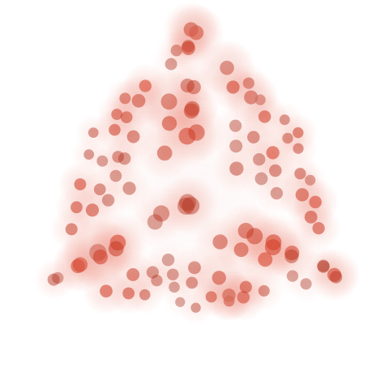

# Velaris agent avatar — state model prototypes

Two renderer explorations for a single agent avatar state contract: the avatar is driven by a small set of continuous parameters (energy, spin, spread, hue, jitter, etc.) that tween toward a target on every state change, instead of cutting between fixed animations or video clips. Adding a new agent state means adding a row to a target table, not commissioning new footage.

Both prototypes are self-contained HTML/JS with no build step or dependencies, rendered on `<canvas>` 2D.

States: `paused` · `idle / armed` · `trigger` · `working` · `needs review` · `succeeded` · `failed`

## Prototypes

| | |
|---|---|
| [**Orbit**](https://yasijay13.github.io/velaris-agent-avatar-proto/orbit.html) <br> Rings and orbiting particles around a glowing core. |  |
| [**Particle cube**](https://yasijay13.github.io/velaris-agent-avatar-proto/particle-cube.html) <br> Rotating point-grid lattice on a cube, with a diagonal brightness wave and per-particle twinkle. |  |

Landing page with both links: https://yasijay13.github.io/velaris-agent-avatar-proto/

## Try it

Open either page and:
- Click a state button to jump directly to that state.
- Type a command and hit **Run** to play the full `trigger → working → success/review/failed → idle` sequence.
- Toggle light/dark card background to check contrast at 260px, 64px, 40px, and 24px.

## Structure

```
index.html            landing page, links to both prototypes
orbit.html             orbital particle renderer
particle-cube.html     particle cube renderer
```
